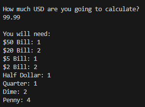

# Coin Change Problem

## Project Description  
---
It calculates the least number of bills and coins for a certain amount of money.

## Installation  
---
Not used for this class.  

## Execution And Usage  
---
All you have to do is pick one of the four provided currencies then input the amount of money you want it to calculate and you should recive an output like this.
  

## Used Technologies  
---
There are no libraries used in this project.

## Current Features  
---
+ Calculates the correct amount and displays it  
+ The currencies are in seperate files, but the open statement is variable.

## Contributions  
---
Not used for this class.  

## Contributors  
---
+ Perrin - Test for bugs 
+ Gavin - Test for bugs
+ Copilot - Debugging

## Author's Information  
---
I am a student in a programming class.

## Change Log  
---
Not used for this class.  

## License
---
Not used for this class. Open source :p